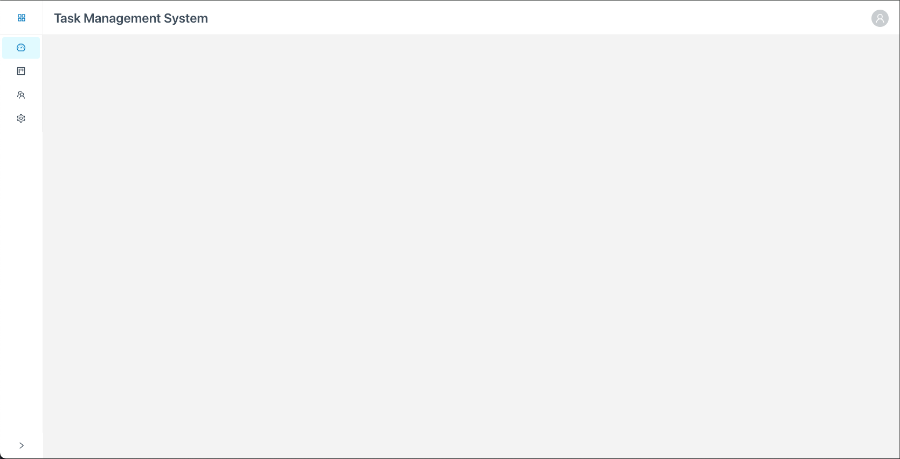

# Deepset - Task Management System Challenge

This task is designed to assess your technical expertise, problem-solving skills, and ability to deliver efficient and polished solutions within a limited time.



---

## Your Task

Implement a real-time collaborative Task Management System with the following requirements:

### 1. Real-Time Task Updates

- Enable real-time synchronization of tasks using a provided mock WebSocket server.
- Ensure updates are reflected across simulated clients in real time.

### 2. Kanban-Style Task Board

- Create a task board with three columns: **To Do**, **In Progress**, and **Done**.
- Implement drag-and-drop functionality to reorder tasks or move them between columns.
- Tasks may contain images that need to be displayed using the provided `OptimizedImage` component.

### 3. Efficient Data Handling

- Load a pre-populated list of **50-100 tasks** from a mock API endpoint.
- Ensure smooth rendering and interactions.
- Pay special attention to performance when tasks contain images.
- Profile and optimize the image processing if necessary.

### 4. Error Handling

- Gracefully handle WebSocket disconnections or failed API calls.

### 5. Testing

- Write **unit tests** for key functionality (e.g., drag-and-drop or task filtering logic).
- Add **one integration test** to validate real-time updates.

---

## Stretch Goals (Optional, Time-Permitting)

1. **Filtering**:
   - Add a dropdown to filter tasks by status (e.g., show only tasks in the "To Do" column).
2. **Inline Editing**:
   - Allow users to double-click a task to edit its title or description.
3. **Offline Support**: Enable offline mode with changes synced back when reconnected.

---

## Tech Stack

You are free to use any libraries or tools you deem necessary. The current project is set up with the following:

- **Framework**: React (with TypeScript).
- **State Management**: Redux Toolkit.
- **Styling**: SASS with Ant Design.

---

## Deliverables

Prepare a zip containing the following:

1. A **working application** with the core features implemented.
2. A **README.md** that includes:
   - Instructions to run the project.
   - A brief explanation of your approach.
   - Any assumptions made during implementation.
3. At least **one unit test** to validate critical functionality (e.g., drag-and-drop logic or WebSocket integration).

Send it to [daniil.merkulov@deepset.ai](mailto:daniil.merkulov@deepset.ai) and [yaqueline.hoyos@deepset.ai](mailto:yaqueline.hoyos@deepset.ai).

Alternatively, you can also create a private GitHub repository with the results and invite `@Danite` and `@yaquelinehoyos` to this repository.

If you have any questions then don’t hesitate to reach out.

---

## Available Services

### Mock API (`mockApi.ts`)

```typescript
getTasks(): Promise<Task[]>
updateTask(id: string, updates: Partial<Task>): Promise<Task>
```

### Mock WebSocket (`mockWebSocket.ts`)

```typescript
connect(): Promise<void>
disconnect(): void
subscribe(handler): () => void
send(message): void
```

---

## Evaluation Criteria

- **Code Quality**: Clean, modular, and maintainable code with effective use of TypeScript.
- **Problem Solving**:
  - Implementation of real-time functionality
  - Ability to address real-time
  - Identification and resolution of performance bottlenecks
- **Performance**:
  - Smooth rendering of tasks and images
  - Efficient memory usage
  - Proper optimization techniques
- **Testing Coverage**: Quality of tests.
- **Creativity**: Attention to detail and any enhancements beyond the core requirements.

---

**Time Limit**: 4 hours

Good luck! Show us your skills, and feel free to reach out with any questions during the challenge.

---

**Happy Coding!** 🚀


## 🛠 My Implementation

### 🔧 How to Run the Project

1. **Clone the repository**
   ```bash
   git clone https://github.com/your-username/task-manager-challenge.git
   cd task-manager-challenge
   ```

2. **Install dependencies**
   ```bash
   npm install
   ```

3. **Start the development server**
   ```bash
   npm run dev
   ```

4. **Run tests**
   ```bash
   npm test
   ```

---

### 💡 My Approach

- Set up a scalable architecture using **React**, **TypeScript**, and **Redux Toolkit**.
- Implemented **real-time synchronization** of tasks using a mock WebSocket server.
- Built a **Kanban-style task board** using `react-beautiful-dnd` for drag-and-drop.
- Added **inline editing**, **filtering**, and **offline support** as stretch goals.
- Ensured responsive design and smooth performance, even with 100 tasks and images.
- Wrote **unit tests** for drag-and-drop and task filtering, and one **integration test** for real-time sync.

---

### 🧠 Assumptions Made

- The **WebSocket** server does not persist data across reloads — task data is stored in memory only.
- Images are **reprocessed on each move** for simplicity; caching between moves wasn't prioritized.
- Full task objects (including order and status) are updated locally and remotely during drag/drop.
- Offline edits are **queued locally** and **auto-synced** once the network connection is restored.
- Images may have duplicated URLs, so caching is performed by `src` and not by task ID.

---